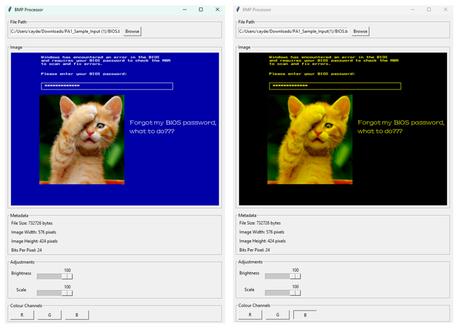
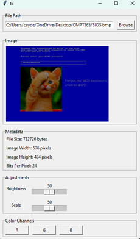
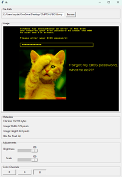

# BMP Image Processing

This project handles BMP files by parsing metadata and displaying details such as pixel width, height, file size, and bits per pixel. Users can adjust parameters like pixel brightness through YUV color manipulation, reduce file size via scaling, and remove specific color channels. All of this processing is done in real time for an interactive experience.

Here are some example images showing the project in use:


*Original Image*


*Processed Image with Brightness and Scale Adjustment*


*Processed Image with Color Channel Removal*

## Requirements

To run this project, you will need to install the required dependencies. You can do this by running:

```bash
pip install -r requirements.txt
```

Then run main.py.
